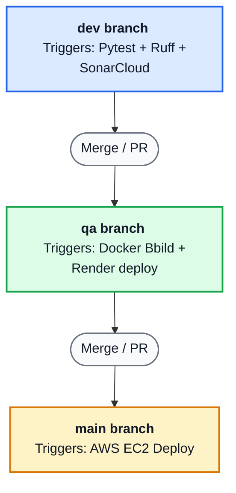

# CI/CD Python Project

## Summary & Core Objectives

* Purpose: To automate the lifecycle of python applications, ensuring early-stage code quality and optimizing infrastructure costs for a laboratory environment.

This repository contains three Python programming tasks integrated with a CI/CD flow. The Python exercises are the vehicle for the pipeline; the process is the main objective.

## Project structure

- `app/`: Source code.
- `tests/`: Unit tests.
- `.github/workflows/`: CI/CD automation pipelines.
- `docs/`: Execution plan, implementation guide, and final summary.

## Tech stack

- Development: Python 3.12, FastAPI.
- Quality: Ruff, Pytest, SonarQube Cloud.
- Packaging: Docker, GitHub Container Registry.
- Automation: GitHub Actions.
- Deployment: Render, AWS EC2.

## Git workflow strategy

- `dev`: Development branch for linting, tests, coverage, and SonarQube.
- `qa`: Quality branch for Docker build, image publication, and validation in Render.
- `main`: Final integration branch and source for AWS EC2 deployment.

## Workflow overview

## Validation

- Run lint with `ruff check .`.
- Run tests with `pytest`.
- Generate coverage with `pytest --cov-report=xml`.
- Validate the health endpoint with `python -m uvicorn app.main:app --reload` and `http://127.0.0.1:8000/health` after activating the virtual environment.
- Validate the Python tasks manually from the terminal:
  - `Dictionary`.
  - `get_total`.
  - `build_word`.

## Deployment

- `qa` publishes the Docker image to GHCR and deploys it to Render.
- `main` triggers deployment to AWS EC2.
- The EC2 service exposes `/health` on port `8000`.
